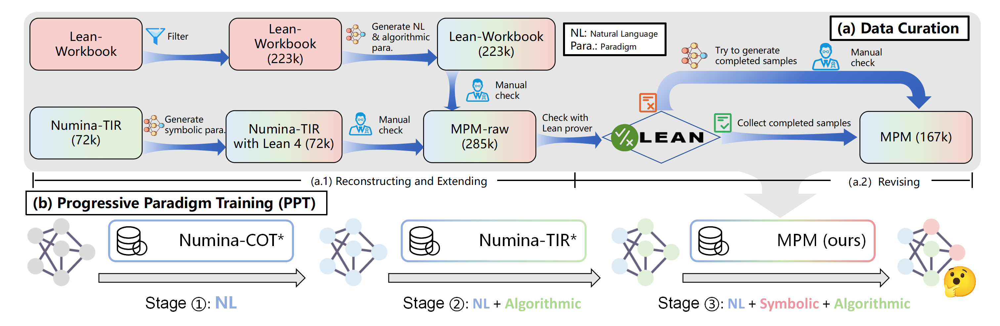

<div align="center">
  <span style="display: inline-block; vertical-align: middle;">
    
  </span>
  <span style="display: inline-block; vertical-align: middle;">
    <h1 style="margin: 0; vertical-align: middle;">Chain-of-Reasoning: Towards Unified Mathematical Reasoning in Large Language Models via a Multi-Paradigm Perspective</h1>
  </span>
</div>


<div align="center">
  📃 <a href="https://arxiv.org/abs/2501.11110">Paper</a><br><br>
</div>

<div align="left">
  📌 Repo for <a href="https://huggingface.co/papers/2501.11110">"Chain-of-Reasoning: Towards Unified Mathematical Reasoning in Large Language Models via a Multi-Paradigm Perspective"</a><br><br>
  👥 Authors: Yiyao Yu, Yuxiang Zhang, Dongdong Zhang, Xiao Liang, Hengyuan Zhang, Xingxing Zhang, Ziyi Yang, Mahmoud Khademi, Hany Awadalla, Junjie Wang, Yujiu Yang, Furu Wei  

</div>


## 📝 Introduction

This project implements a novel Chain-of-Reasoning (CoR) framework to significantly enhance the mathematical reasoning capabilities of large language models.  By integrating Natural Language Reasoning (NLR), Algorithmic Reasoning (AR), and Symbolic Reasoning (SR), our model overcomes the limitations of single-paradigm approaches and achieves superior performance on a variety of mathematical tasks, including theorem proving and arithmetic calculations.  The model is trained using a progressive paradigm training (PPT) strategy, leading to improved efficiency and strong zero-shot generalization capabilities. It aims to deal with the challenge that existing LLMs often depend on single reasoning paradigm, which resticts the model performance, and the model can achieve multi-paradigm cooperation.

<div align="center">

</div>

## 🎉 What's New

- **[2025.02.20]** 📣 The training and evaluation code for the CoR is released.

## 📄 Table of Contents

<details>
<summary>
Click to expand the table of contents
</summary>

- [📝 Introduction](#-introduction)
- [🎉 What's New](#-whats-new)
- [📄 Table of Contents](#-table-of-contents)
- [🔧 Setup Environment](#-setup-environment)
- [📚 Create MPM dataset](#-create-mpm-dataset)
- [📊 Evaluate Benchmark](#-evaluate-benchmark)
- [🏋️ Training](#️-training)
- [📊 Evaluation](#-evaluation)
- [🏆 Results](#-results)
- [📖 Citation](#-citation)

</details>

## 🔧 Setup Environment

1. **Install Lean 4**

   Follow the instructions on the [**Lean Community**](https://leanprover-community.github.io/install/linux.html) to set up **elan** and **Lean 4**.

2. **Clone the repository and submodules**

    ```sh
    git clone --recurse-submodules https://github.com/yyyhz/CoR.git
    cd CoR
    ```

3. **Install dependencies**

    ```sh
    pip3 install -r requirements.txt
    ```

4. **Build Mathlib4**

    ```sh
    cd mathlib4
    lake build
    ```

## 📚 Create MPM dataset

<div align="center">

</div>

1. **Clone the Lean-Workbook dataset**

    Clone the `lean_workbook.json` from [**Lean-Workbook**](https://huggingface.co/datasets/internlm/Lean-Workbook), then change the path to the json file in `./utils/generate_informalproof.py`, meanwhile set the save_dir to the path where you want to save the enhanced dataset.

2. **Generate informal proofs**

    Change the `export OPENAI_API_KEY=...` to your OpenAI API key, then run the following script to generate informal proofs for the Lean-Workbook dataset:
    ```sh
    bash ./script/leanwb_informalproof.sh
    ```

3. **Clone the NuminaMath-TIR dataset**

    Clone the ``data/train-00000-of-00001.parquet`` from [**NuminaMath-TIR**](https://huggingface.co/datasets/AI-MO/NuminaMath-TIR) and convert it to JSON format, then change the path to the json file in `./utils/generate_lean4.py`, meanwhile set the save_dir to the path where you want to save the enhanced dataset.

4. **Generate Lean4 proofs**

    Change the `export OPENAI_API_KEY=...` to your OpenAI API key, then run the following script to generate Lean4 proofs for the NuminaMath-TIR dataset:
    ```sh
    bash ./script/numinatir_lean4.sh
    ```
    
6. **Remove Data Leakage**

    Change the target data path and your generated data path in `discontaminate.sh`, then run the following script to remove potential data leakage:
    ```sh
    bash discontaminate.sh
    ```

## 🏋️ Training

After creating the MPM dataset according to the above steps and the guidance in our paper, you can start training the model (you might need to change the leave blank or fake fields in the script according to your own situation):
```sh
bash ./script/train_CoR.sh
```

## 📊 Evaluation

We provide three scipts for evaluating the model on different benchmarks:

```sh
bash ./script/eval_CoR_math.sh
bash ./script/eval_CoR_aime2024.sh
bash ./script/eval_CoR_minif2f.sh
```

## 🏆 Results

<div align="center">

</div>

## 📖 Citation

If you find this repository useful, please consider giving star and citing our paper:

```plaintext
@misc{yu2025chainofreasoningunifiedmathematicalreasoning,
      title={Chain-of-Reasoning: Towards Unified Mathematical Reasoning in Large Language Models via a Multi-Paradigm Perspective}, 
      author={Yiyao Yu and Yuxiang Zhang and Dongdong Zhang and Xiao Liang and Hengyuan Zhang and Xingxing Zhang and Ziyi Yang and Mahmoud Khademi and Hany Awadalla and Junjie Wang and Yujiu Yang and Furu Wei},
      year={2025},
      eprint={2501.11110},
      archivePrefix={arXiv},
      primaryClass={cs.CL},
      url={https://arxiv.org/abs/2501.11110}, 
}
```

## Contributing

This project welcomes contributions and suggestions.  Most contributions require you to agree to a
Contributor License Agreement (CLA) declaring that you have the right to, and actually do, grant us
the rights to use your contribution. For details, visit https://cla.opensource.microsoft.com.

When you submit a pull request, a CLA bot will automatically determine whether you need to provide
a CLA and decorate the PR appropriately (e.g., status check, comment). Simply follow the instructions
provided by the bot. You will only need to do this once across all repos using our CLA.

This project has adopted the [Microsoft Open Source Code of Conduct](https://opensource.microsoft.com/codeofconduct/).
For more information see the [Code of Conduct FAQ](https://opensource.microsoft.com/codeofconduct/faq/) or
contact [opencode@microsoft.com](mailto:opencode@microsoft.com) with any additional questions or comments.

## Trademarks

This project may contain trademarks or logos for projects, products, or services. Authorized use of Microsoft 
trademarks or logos is subject to and must follow 
[Microsoft's Trademark & Brand Guidelines](https://www.microsoft.com/en-us/legal/intellectualproperty/trademarks/usage/general).
Use of Microsoft trademarks or logos in modified versions of this project must not cause confusion or imply Microsoft sponsorship.
Any use of third-party trademarks or logos are subject to those third-party's policies.
